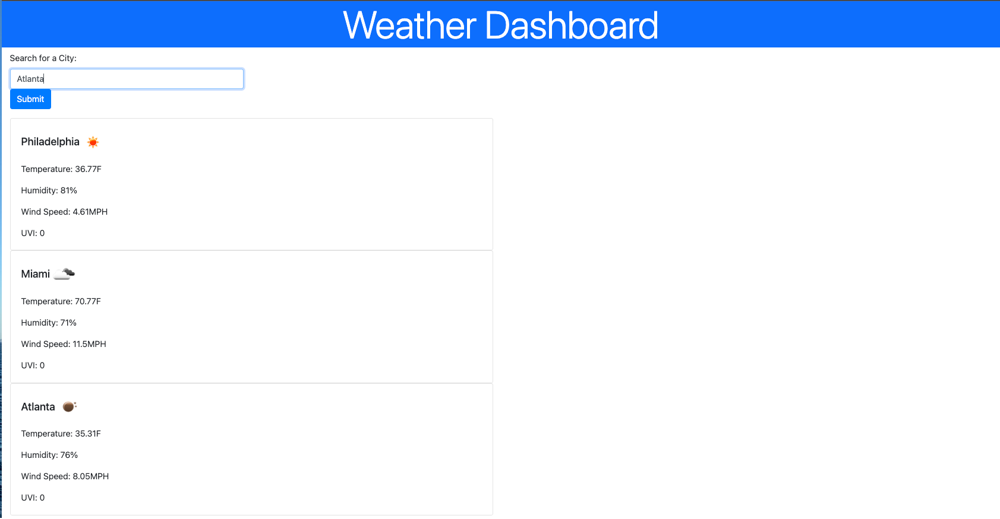

# Weather-Dashboard

Welcome! Everybody's got a daily routine, and I'm sure a task from that routine is to check the weather, especially since the dog days of summer are over and we're treading into the brisk, fall weather. This is how the weather dashboard I've created (screenshot below) becomes useful! As a user of the weather dashboard, you'll be able to look up any state, and see the following information:

- 

[Deployed Website](https://amylipscomb.github.io/weather-dashboard/)

<strong>My Task</strong>