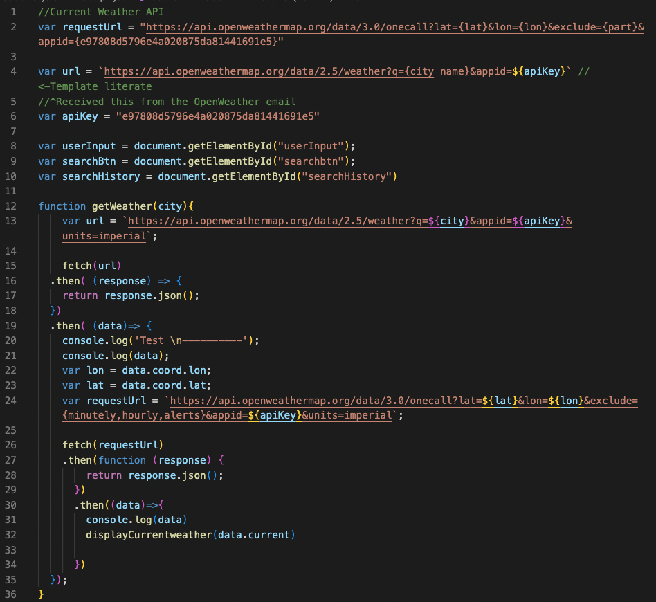

# Weather-Dashboard

Welcome! Everybody's got a daily routine, and I'm sure a task from that routine is to check the weather, especially since the dog days of summer are over and we're treading into the brisk, fall weather. This is how the weather dashboard I've created (screenshot below) becomes useful! As a user of the weather dashboard, you'll be able to look up any state, and see the following information:

- Temperature
- Humidity 
- Wind Speed 
- UVI

[Deployed Website](https://amylipscomb.github.io/weather-dashboard/)

<strong>My Task</strong>

I utilized HTML, CSS, JavaScript and Bootstrap. Bootstrap is a free coding library that allows its users to create websites, utilizing premade bits of code written in HTML, CSS or JavaScript. In order to use this library, I had to first link in the website via index.html. The placement is crucial, because in order for my personalized style.css to be applied, the Bootstrap link had to be placed before the linking of my style.css. Below is a screenshot: 

After linking in the style sheets, I then linked in the JavaScript file to the index.html. Placement for this is also important. In order for the JavaScript to be displayed on the website, the placement of the link has to go within the html section. Once this was linked, I was able to move forward with the JavaScript code. 

To receive weather information, I used a weather API (Application Programming Interface). Basically, an API is used to allow two applications to talk to each other. Every morning, whenever we're checking the weather, we're using an API! I used the following website: https://openweathermap.org/api, to subscribe to a weather API. Once I was subscribed and recieved an API key, I was able to complete a fetch, using JavaScript. A fetch literally allows you to access the resources from the URL that you're requesting a fetch from. Below is the JS code I used. 

Once I was able to make a successful fetch, I then created a function and within that function, created, modified and appended various elements to the website. 

While working on the weather dashboard, I made sure to save my work constantly, utilizing 'git push', and made sure that each time I made commits, each commit had descriptive messages. 

<strong>Technologies Used</strong>	

-	HTML 
-	CSS
-	VS Code
-   JavaScript
-   FontAwesome
-   Bootstrap

I hope you enjoyed viewing my weather dashboard, and learning about the process behind the coding!

